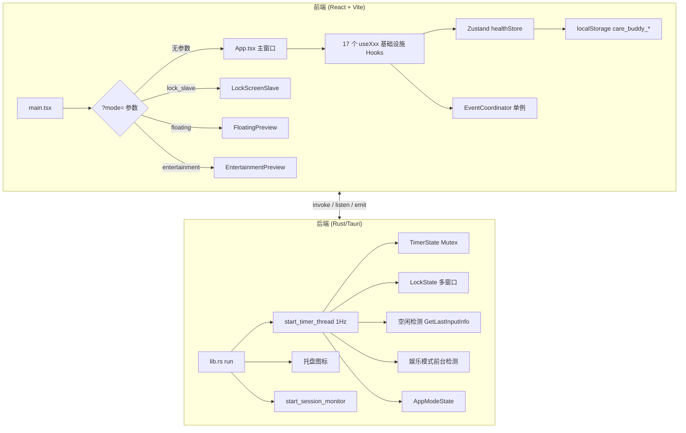
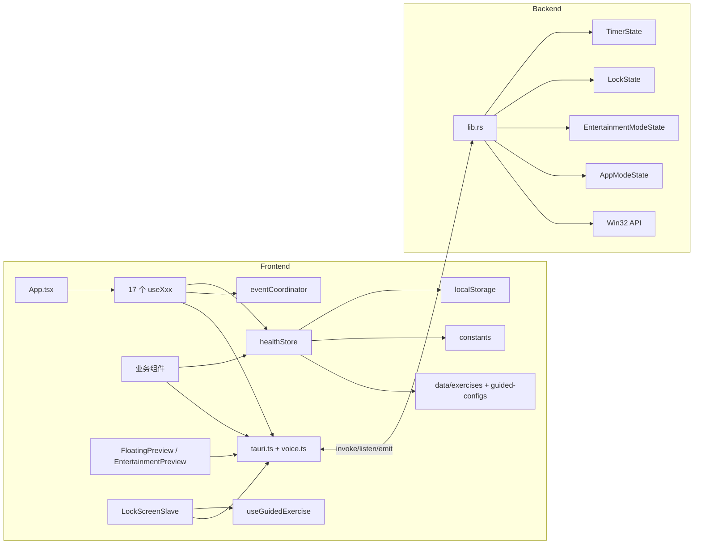
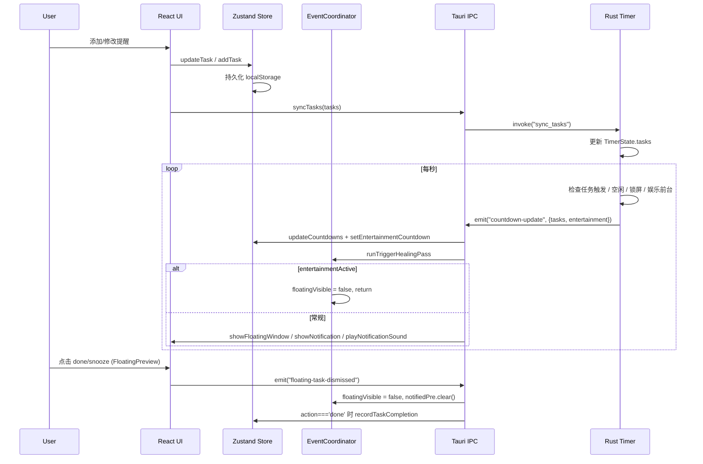
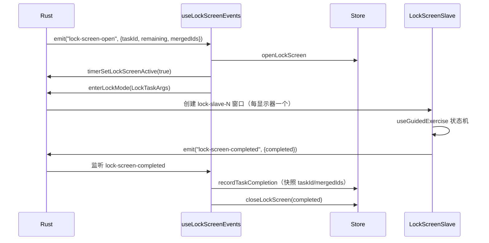
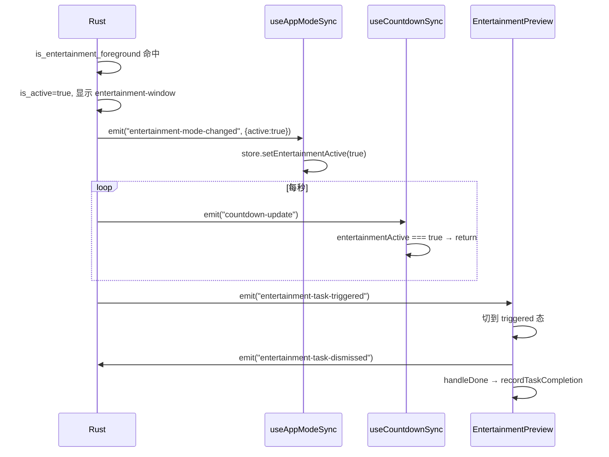

# CareBuddy Code Wiki

> 本文档是 care-buddy 项目的结构化代码百科，涵盖整体架构、核心模块、关键类/函数、依赖关系与运行方式。
>
> 项目定位：基于 Tauri v2 + React 19 的轻量桌面健康提醒应用，帮助用户在长时间使用电脑的过程中自然建立健康作息节奏，降低久坐、用眼过度等问题带来的健康负担。

---

## 1. 项目概览

| 项目 | 说明 |
|------|------|
| 名称 | CareBuddy |
| 版本 | Rust 后端 `1.7.0` / 前端常量 `VERSION = '1.8.0'`（存在不一致，待同步） |
| 应用标识 | `com.carebuddy.app` |
| 主窗口尺寸 | 492 × 696，无边框（`decorations: false`），不可调整大小 |
| 主要功能 | 久坐/喝水/护眼提醒、全屏锁屏、引导锻炼、悬浮预通知窗、娱乐模式覆盖、数据统计 |
| 运行平台 | Windows（主要实现），Tauri 配置保留跨平台扩展能力 |
| 入口数 | 4 个 Webview 入口（主窗口 / 副屏锁屏 / 浮窗 / 娱乐胶囊） |

---

## 2. 技术栈

| 层级 | 技术/库 | 版本 | 说明 |
|------|--------|------|------|
| 桌面框架 | Tauri | v2 | Rust 后端 + Webview 前端 |
| 前端框架 | React | 19.2.7 | 函数组件 + Hooks |
| 语言 | TypeScript | 6.0.3 | strict 模式 |
| 样式 | Tailwind CSS | 4.3.0 | `@tailwindcss/vite` 插件，CSS-first 配置 |
| UI 组件 | shadcn/ui | v4（base-nova） | 32+ 个基础组件，`@base-ui/react` 底层 |
| 状态管理 | Zustand | 5.0.14 | 单一 Store + 模块级单例 EventCoordinator |
| 动画 | motion / tw-animate-css | 12.40.0 | framer-motion 子代 + CSS 动画 |
| 图表 | Recharts | 3.8.0 | 数据统计图表 |
| 字体 | Geist Variable | — | 通过 `@fontsource-variable/geist` |
| 国际化 | i18next / react-i18next | 26.3.1 / 17.0.8 | 语言包内联在 `main.tsx` |
| 日期 | date-fns | 4.4.0 | 日期格式化与计算 |
| 提示 | sonner | 2.0.7 | Toast 通知 |
| 主题 | next-themes | 0.4.6 | light/dark/system |
| 构建 | Vite | 6.4.3 | 开发服务器端口 5175 |
| Rust 后端 | Rust + Tauri 插件 | 2021 edition | timer / idle / lock / tray / entertainment / notifications |
| Rust 音频 | rodio | 0.21.1 | 自定义提示音播放 |
| Rust Windows API | windows | 0.58 | 空闲检测、会话锁、DWM、进程查询 |

---

## 3. 项目目录结构

```text
care-buddy/
├── .github/workflows/ci.yml     # CI：npm run build → cargo check（Windows-latest）
├── .trae/rules/                 # Trae IDE 规则
├── AGENTS.md                    # 项目规范与 Agent 指南
├── CODE_WIKI.md                 # 本文档
├── scripts/clean-data.ps1       # 清理用户数据脚本
├── docs/                        # 设计系统、ADR、Agent 文档
├── src/                         # React 前端源码
│   ├── App.tsx                  # 主应用入口组件
│   ├── main.tsx                 # DOM 渲染 + i18n + 4 入口路由
│   ├── components/              # 业务组件 + shadcn UI（32 个）
│   │   ├── guided/              # 引导锻炼子组件
│   │   ├── heatmap/             # 热力图子组件
│   │   ├── stats/               # 统计页子组件
│   │   └── ui/                  # shadcn v4 基础组件
│   ├── constants/               # 默认任务/设置/分类/证据/统计配置
│   ├── data/                    # 36 个运动库 + 3 个套餐 + 引导配置
│   ├── hooks/                   # 17 个基础设施与业务 Hooks
│   ├── lib/utils.ts             # shadcn cn 合并（含 tailwind-merge 陷阱修复）
│   ├── services/                # Tauri IPC / EventCoordinator / Voice
│   ├── store/                   # Zustand healthStore 统一导出
│   ├── styles/global.css        # 主题变量、动画、布局变量
│   ├── types/                   # TypeScript 类型定义（index + exercise）
│   └── utils/                   # time / audio / storage / exercise / statsRecorder / recommend
├── src-tauri/                   # Rust 后端源码
│   ├── src/lib.rs               # 核心逻辑（1500+ 行：timer / idle / lock / tray / entertainment）
│   ├── src/main.rs              # 入口：调用 care_buddy_lib::run()
│   ├── capabilities/main.json   # Tauri 权限配置（4 类窗口共用）
│   ├── Cargo.toml               # Rust 依赖
│   ├── tauri.conf.json          # Tauri 应用配置
│   └── icons/                   # 应用图标资源
├── package.json                 # npm 脚本与依赖
├── tsconfig.json                # TypeScript 配置
├── vite.config.ts               # Vite 配置 + 路径别名 @/ + vendor chunk 拆分
└── components.json              # shadcn v4 配置（含 @heatmap registry）
```

---

## 4. 整体架构



### 4.1 四入口设计

应用通过 URL 查询参数 `?mode=` 区分四个入口：

| 模式 | 组件 | 用途 | 窗口 |
|------|------|------|------|
| 无参数 | `App.tsx` | 主应用界面 | 主窗口 492×696（静态声明） |
| `lock_slave` | `LockScreenSlave.tsx` | 全屏锁屏 Webview | 每显示器一个 `lock-slave-N`（运行时创建） |
| `floating` | `FloatingPreview.tsx` | 置顶悬浮预通知窗 | `floating-window` 156 (preview) / 278 (triggered) × 48 |
| `entertainment` | `EntertainmentPreview.tsx` | 娱乐胶囊窗 | `entertainment-window` 120 (idle) / 278 (triggered) × 48 |

### 4.2 双维度架构（核心）

应用采用 **维度 A（appMode）× 维度 B（娱乐模式）** 互斥分发架构：

| 维度 | 名称 | 取值 | 节奏来源 | 窗口 |
|------|------|------|---------|------|
| A | appMode | `notification` / `lock` / `floating` | 任务 `interval` 字段 | 通知 / 锁屏 / 浮窗 |
| B | 娱乐模式 | `entertainmentActive: boolean` | `entertainmentReminderMinutes`（默认 20 min） | 娱乐胶囊 |

**关键约束**：当 `entertainment_active === true` 时，appMode 分发**完全跳过**，且不依赖 `app_mode_initialized`。娱乐模式激活时同步隐藏浮窗（`sync_floating_visibility`）。

### 4.3 锁屏多显示器策略

- **主显示器**：承载完整交互界面（引导锻炼、倒计时、操作按钮）。
- **副显示器**：仅显示静态提示文案（`is_primary=false`，无交互、无 state）。
- **看门狗**：后端每秒检查 `lock-slave-*` 窗口存活 + 屏幕覆盖完整性，缺失时自动重建。

---

## 5. 前端核心模块

### 5.1 入口与路由（[src/main.tsx](src/main.tsx)）

- 同步初始化 i18next（`initReactI18next`），内联 `zhCN` / `enUS` 两套语言包，默认 `zh-CN`。
- 解析 `?mode=` URL 参数路由到四个入口组件。
- 所有入口包裹 `ErrorBoundary` 与 `I18nextProvider` 后挂载到 `#app`。

语言包顶层命名空间：`app` / `nav` / `tabs` / `dashboard` / `stats` / `tasks` / `taskNames` / `taskDesc` / `time` / `buttons` / `settings` / `exercise` / `guided` / `lock` / `window` / `timerCarousel` / `categories` / `statCards` / `floating` / `common`。其中 `settings` 命名空间包含完整娱乐模式文案。

### 5.2 主应用组件（[src/App.tsx](src/App.tsx)）

`App.tsx` 职责：

1. 在 JSX 上方以 `useXxx()` 形式调用全部 17 个基础设施 Hook（**严禁直接写 useEffect/setInterval/listen**）。
2. 维护顶部 Tab 导航（main / exercise / stats）+ `settingsOpen` 设置面板覆盖层。
3. `viewMode` 状态切换视图，配合 `motion` 做横向滑动过渡。
4. 监听 `Ctrl+G` 切换网格调试背景，`Esc` 关闭设置面板。
5. 任务变更时通过 `syncTasks(tasks)` IPC 同步到 Rust 后端，`syncLock` ref 防重入。

### 5.3 基础设施 Hooks（17 个，调用顺序固定）

| # | Hook | 文件 | 职责 | EventCoordinator |
|---|------|------|------|------------------|
| 1 | `useAppInit` | [useAppInit.ts](src/hooks/useAppInit.ts) | 检查日期切换、同步任务、恢复暂停状态、静默启动时隐藏窗口 | — |
| 2 | `useCountdownSync` | [useCountdownSync.ts](src/hooks/useCountdownSync.ts) | 监听 `countdown-update`/`task-reset-confirmed`，写入 store；预通知浮窗、系统通知、提示音；**`entertainmentActive` 时直接 return 跳过常规分发** | ✅ `clearAll` / `floatingVisible` / `notifiedPre` / `handledTriggers` / `triggerStreak` |
| 3 | `useTriggerHealing` | [useTriggerHealing.ts](src/hooks/useTriggerHealing.ts) | 触发态自愈：连续 ≥2 帧观测到 triggered 才请求后端重发；导出 `runTriggerHealingPass(countdowns)` 供 useCountdownSync 单线程调用 | ✅ `handledTriggers` / `triggerStreak` |
| 4 | `useFloatingManager` | [useFloatingManager.ts](src/hooks/useFloatingManager.ts) | 监听 `floating-task-dismissed`；锁屏退出后归位浮窗；done 时调用 `recordTaskCompletion` | ✅ `floatingVisible` / `notifiedPre` |
| 5 | `useEntertainmentManager` | [useEntertainmentManager.ts](src/hooks/useEntertainmentManager.ts) | 监听 `entertainment-task-dismissed`（统计记录已移至 EntertainmentPreview 内） | — |
| 6 | `useModeTransition` | [useModeTransition.ts](src/hooks/useModeTransition.ts) | 监听 `app-mode-changed`，立即调整浮窗可见性（不等下次 countdown-update） | ✅ `floatingVisible` |
| 7 | `useAppModeSync` | [useAppModeSync.ts](src/hooks/useAppModeSync.ts) | 启动期把前端真实 appMode 推回后端（单一可信源，消除 Rust 默认 `notification` 导致的自动 +1）；保留监听 `app-mode-changed` / `entertainment-mode-changed` / `settings-updated` 同步前端 | — |
| 8 | `useWorkMinutesTracker` | [useWorkMinutesTracker.ts](src/hooks/useWorkMinutesTracker.ts) | 每分钟累加工作时长（条件：非暂停/非空闲/非锁屏） | — |
| 9 | `useDailyStatsAutoSave` | [useDailyStatsAutoSave.ts](src/hooks/useDailyStatsAutoSave.ts) | 每 5 分钟自动保存每日统计，unmount 时兜底再保存一次 | — |
| 10 | `useLockScreenEvents` | [useLockScreenEvents.ts](src/hooks/useLockScreenEvents.ts) | 监听 `task-notification` / `lock-screen-open` / `lock-screen-completed`；`task-notification` 仅在 `appMode==='notification'` 时自动 +1（双保险守卫，前后端不同步时不会污染计数）；锁屏计数由本 hook 在 closeLockScreen 前快照处理；合并锁屏时 `aggregateExerciseIds(primary, merged)` 聚合 primary + 各 merged 中 exerciseIds 非空者（primary 优先 + 首次去重），时长取去重后 `computeExerciseDuration`，全部为空 fallback `task.lockDuration`；参与判定 = `lockScreenExerciseEnabled && exerciseIds 非空`（已移除 isExerciseTask 字段） | — |
| 11 | `useIdleDetection` | [useIdleDetection.ts](src/hooks/useIdleDetection.ts) | 监听 `idle-status-changed` 更新 store `isIdle`；空闲时隐藏浮窗 | — |
| 12 | `useSystemLockEvents` | [useSystemLockEvents.ts](src/hooks/useSystemLockEvents.ts) | 监听系统锁屏/解锁事件，调用 `timerSetSystemLocked` | — |
| 13 | `useTrayMenuEvents` | [useTrayMenuEvents.ts](src/hooks/useTrayMenuEvents.ts) | 处理托盘 `reset-all-tasks` / `toggle-pause`；reset 成功后 emit `floating-reset-all` | — |
| 14 | `usePauseStateSync` | [usePauseStateSync.ts](src/hooks/usePauseStateSync.ts) | 监听跨窗口 `pause-state-updated` | — |
| 15 | `useSettingsSync` | [useSettingsSync.ts](src/hooks/useSettingsSync.ts) | 监听 `settings-updated` 合并到 store | — |
| 16 | `useNotificationPermission` | [useNotificationPermission.ts](src/hooks/useNotificationPermission.ts) | 应用启动时请求系统通知权限 | — |
| 17 | `useGuidedExercise` | [useGuidedExercise.ts](src/hooks/useGuidedExercise.ts) | 引导锻炼状态机 Hook（独立，由 LockScreenSlave 调用） | — |

### 5.4 引导锻炼状态机（[src/hooks/useGuidedExercise.ts](src/hooks/useGuidedExercise.ts)）

状态流转：

```text
idle → prep → active(step → step) ⇄ transition → roundComplete → active → ... → done
```

状态定义：`'idle' | 'prep' | 'transition' | 'active' | 'roundComplete' | 'done'`

关键能力：

- 单 `setInterval`（100ms tick）按 `state.status` 分支处理，避免多 timer 竞态。
- `prep` 阶段倒数 3-2-1 通过 TTS 播报。
- `active` 阶段按 `GuidedStep` 整秒倒计时；长动作（duration > 5s）最后 3 秒给预告 beep。
- `beatMode` / `step.beat` / `duration ≤ 3s` 用 `playBeatSound` 替代 TTS（适合快速动作）。
- `transition` 默认 0.3s（可配置 0.5s/2s 等，单侧保持类动作用 `transitionDuration: 2` 实现左右自动换边）。
- `roundComplete` 0.8s，TTS 播报"第 X 组"。
- 完成时 `playCompleteSound`。

主要 API：

```ts
const { state, actions, isSpeechAvailable } = useGuidedExercise();
actions.startExercise(exercise, config);  // 进入 prep
actions.exit();                            // 清理 + 回到 INITIAL_STATE
actions.setMuted(muted);                   // 静音切换
```

### 5.5 状态管理（[src/store/healthStore.ts](src/store/healthStore.ts)）

使用 Zustand 单一 Store，所有 state 与 actions 集中在 `useHealthStore`。所有 state 改动通过 `setStorage` 同步持久化到 `localStorage`（`care_buddy_` 前缀）。任务操作走乐观更新 + IPC 调用，失败回滚。

#### 5.5.1 主要状态

| 分类 | 状态 | 类型 | 说明 |
|------|------|------|------|
| 任务 | `tasks` | `Task[]` | 任务配置列表（与 localStorage 合并默认任务） |
| 任务 | `taskStates` | `Record<string, TaskState>` | 每任务运行时状态（status/countdown/paused/snoozed/snoozeUntil） |
| 设置 | `settings` | `AppSettings` | 完整应用设置（27 个字段） |
| 全局 | `isPaused` | `boolean` | 全局暂停 |
| 全局 | `isIdle` | `boolean` | 空闲状态 |
| 应用模式 | `appMode` | `'notification' \| 'lock' \| 'floating'` | 应用模式（A 维度） |
| 娱乐 | `entertainmentActive` | `boolean` | 娱乐模式激活（B 维度，场景覆盖层） |
| 娱乐 | `entertainmentCountdown` | `{ remaining, total } \| null` | 娱乐统一倒计时 |
| 统计 | `stats` | `Stats` | 累计统计 |
| 统计 | `todayStats` | `TodayStats` | 今日统计（含 24h `hourly` 数组、`categoryCounts`、`packageCounts`） |
| 统计 | `dailyStats` | `DailyStats[]` | 历史每日统计（保留最近 90 天） |
| 统计 | `categoryExerciseCounts` | `Record<ExerciseCategory, number>` | 按运动分类累计 |
| 统计 | `packageCompleteCounts` | `Record<PackageType, number>` | 按套餐累计 |
| 统计 | `dailyGoals` | `DailyGoals` | 每日目标（sitBreaks/eyeCare/waterCups/exercises） |
| 锁屏 | `lockScreen` | `LockScreen` | `{ active, taskId, remaining, mergedIds, waitingConfirm }` |
| 运动面板 | `exercisePanel` | `ExercisePanel` | `{ active, packageId, singleExerciseId, currentIndex }` |
| UI | `statsRange` / `rightCollapsed` / `cardPage` / `chartMode` | — | 统计页 UI 状态 |

#### 5.5.2 主要 Actions

| 分类 | Actions |
|------|---------|
| 任务 | `updateTask` / `addTask` / `removeTask` / `toggleTask` / `resetTask` / `pauseTask` / `resumeTask` |
| 倒计时 | `updateCountdowns`（批量从后端 payload 同步，保留 `paused` 状态） / `updateCountdown` / `updateTaskCountdown`（`task-reset-confirmed` 专用，镜像后端完整字段） |
| 设置 | `updateSettings` / `loadSettings` / `saveSettings` |
| 统计 | `incrementStat` / `incrementSitBreaks` / `incrementWaterCups` / `incrementEyeCare` / `incrementCustomBreaks` / `incrementWorkMinutes` / `incrementExercisesCompleted` / `incrementPackagesCompleted` / `incrementCategoryExercise` / `incrementPackageCompleteCount` / `addExerciseMinutes` / `updateDailyStats` / `getWeeklyStats` / `getMonthlyStats` / `checkDayTransition` |
| 锁屏 | `openLockScreen` / `closeLockScreen` / `setLockWaitingConfirm` |
| 运动面板 | `openExercisePanel` / `openSingleExercisePanel` / `advanceExercise` / `skipCurrentExercise` / `closeExercisePanel` |
| 娱乐 / 全局 | `setPaused` / `setIdle` / `setAppMode` / `setEntertainmentActive` / `setEntertainmentCountdown` / `setRightCollapsed` / `setCardPage` / `setChartMode` / `resetAllTasks`（调 `timerResetAll`，返回 boolean 成功状态） |
| 统计页 | `setDailyGoals` / `resetDailyGoals` / `setStatsRange` |

#### 5.5.3 初始化策略

- `tasks`：默认 `DEFAULT_TASKS` 与 localStorage 存储做 merge（默认优先结构、存储覆盖字段，存储里的自定义任务追加到末尾）。
- `taskStates`：基于 merge 后的 tasks 用 `initTaskStates` 生成，`status: 'idle'`，`countdown = interval * 60`。
- `settings`：`{ ...DEFAULT_SETTINGS, ...stored }`。
- `appMode` 兼容性迁移：旧的 `'normal'` / `'entertainment'` 值回退为 `'notification'`。
- 日期切换由 `finalizeOldDay` + `getTodayStatsForUpdate` + `checkDayTransition` 统一处理。

---

## 6. 多窗口入口组件

### 6.1 LockScreenSlave（[src/components/LockScreenSlave.tsx](src/components/LockScreenSlave.tsx)）

URL：`?mode=lock_slave&is_primary=true&title=...&duration=...&strict_mode=...&auto_unlock=...&is_exercise_mode=...&exercise_ids=...`

| 显示器 | 行为 |
|--------|------|
| 主（`is_primary=true`，默认） | 完整交互界面：引导锻炼 + 倒计时 + 操作按钮；三态 `idle / exercising / finished` |
| 副（`is_primary=false`） | 直接渲染 `<SecondaryScreenHint />`，仅显示 `t('lock.lookAtMainDisplay')`，无任何交互/state/useEffect |

**关键事件**：

- Emit：`lock-screen-completed { completed: boolean }`
- IPC：`timerSetLockScreenActive(false)` / `exitLockMode()`
- 使用 `useGuidedExercise` Hook 驱动锻炼流程
- `completionHandledRef` 防止重复完成
- `autoUnlock=true` 时自动调用 `handleComplete(false)`
- 倒计时最后 3 秒播放 `playCountSound`

### 6.2 FloatingPreview（[src/components/FloatingPreview.tsx](src/components/FloatingPreview.tsx)）

URL：`?mode=floating`，胶囊窗口 156 (preview) / 278 (triggered) × 48

**三态状态机**：`'idle' | 'preview' | 'triggered'`

| 事件 | 用途 |
|------|------|
| `floating-preview-update` | 接收主窗口 emit 的预览数据（独有） |
| `floating-task-triggered` | 触发态切换（带队列，可堆叠多个） |
| `floating-task-cleared` | 单任务/全量清除 |
| `floating-reset-all` | 主窗口重置时清空 |
| `app-mode-changed` | 非 floating 模式时清空触发态 |
| `idle-status-changed` | 进入空闲"离开即重置"，退出空闲归位预览态 |

- Emit：`floating-task-dismissed { taskId, mergedIds, action }`
- IPC：`get_floating_state` / `timerReopenTriggered`（挂载自愈）/ `timerSnoozeTask` / `startFloatingDrag` / `startFloatingResize` / `saveFloatingPosition` / `getFloatingPosition`
- 统计记录不在 FloatingPreview 内处理，由主窗口 `useFloatingManager` 响应 dismissed 事件统一调用 `recordTaskCompletion`

### 6.3 EntertainmentPreview（[src/components/EntertainmentPreview.tsx](src/components/EntertainmentPreview.tsx)）

URL：`?mode=entertainment`，胶囊窗口 120 (idle) / 278 (triggered) × 48

**两态状态机**：`'idle' | 'triggered'`（无 preview 态，娱乐模式不显示任务倒计时预览）

| 事件 | 用途 |
|------|------|
| `entertainment-task-triggered` | 触发态切换（无队列，直接覆盖为最新一次） |
| `entertainment-task-cleared` | 支持 `clearAll: true` 全清或 `taskId` 单清 |
| `entertainment-mode-changed` | 娱乐模式退出时归位 idle |
| `entertainment-opacity-changed` / `entertainment-snooze-changed` | 设置实时更新 |
| `countdown-update`（通过 `onCountdownUpdate`） | **直接订阅后端广播**用于 idle 态显示娱乐倒计时（独立 webview 未挂载 `<App />`，store 里没有倒计时数据） |

- Emit：`entertainment-task-dismissed`（payload 中 `taskId: ''`，仅用 `mergedIds`）
- IPC：`getEntertainmentState` / `getCurrentTriggeredTask`（挂载时拉取 120s 内 last_sent payload 自愈）/ `timerSnoozeTask` / `startEntertainmentDrag` / `startEntertainmentResize` / `saveEntertainmentPosition` / `getEntertainmentPosition`
- **统计记录在组件内 `handleDone` 直接调用 `recordTaskCompletion`**（避免主窗口关闭后统计丢失 — 与 FloatingPreview 的关键架构差异）

### 6.4 FloatingPreview vs EntertainmentPreview 关键差异

| 维度 | FloatingPreview | EntertainmentPreview |
|------|-----------------|----------------------|
| 状态机 | idle / preview / triggered（三态） | idle / triggered（两态） |
| 触发队列 | 有（`triggeredQueue.current`） | 无（直接覆盖） |
| 预览数据来源 | `floating-preview-update` 事件 | 不需要（idle 显示自身倒计时） |
| 倒计时数据 | 来自 preview 事件 payload | 直接订阅 `countdown-update` |
| 挂载时自愈 | `timerReopenTriggered()` | `getCurrentTriggeredTask()` |
| 设置实时更新 | 通过 `app-mode-changed` payload 同步 | 独立监听 `entertainment-opacity-changed` / `entertainment-snooze-changed` |
| 空闲处理 | 监听 `idle-status-changed` 归位 | 不处理（与空闲互斥） |
| 统计记录 | 主窗口 useFloatingManager 处理 | 组件内 handleDone 直接调用 |
| 位置存储 | `getFloatingPosition` / `saveFloatingPosition` | `getEntertainmentPosition` / `saveEntertainmentPosition` |

> 位置存储 IPC 共享同一组 storage key（`capsule_position_x/y` + `floating_position_x/y` + `entertainment_position_x/y`），任一窗口保存都会同时写入三个键，回退链为 capsule → floating → entertainment。

---

## 7. 前端业务组件

### 7.1 主窗口业务组件分层

| 组件 | 文件 | 职责 |
|------|------|------|
| `Dashboard` | [Dashboard.tsx](src/components/Dashboard.tsx) | 首页主面板容器：纵向 flex 组合 `HealthMetricsSection` + `CountdownSection` |
| `HealthMetricsSection` | [HealthMetricsSection.tsx](src/components/HealthMetricsSection.tsx) | 健康指标卡：recharts `RadialBarChart` 半圆环显示 4 项目标完成率 + `MiniWeekdayHeatmap` + `MiniBarChart`（5 类运动分布） + 昨日对比 |
| `CountdownSection` | [CountdownSection.tsx](src/components/CountdownSection.tsx) | 倒计时区：`AnimatedCircularProgressBar` + `number-flow` 数字滚动 + 暂停/恢复/重置/贪睡 + `Pagination`（4 任务 ×3/页） |
| `TodayStatsSection` | [TodayStatsSection.tsx](src/components/TodayStatsSection.tsx) | 今日统计 + 7 天柱状图，支持 `chartMode` 切换（任务/分类/套餐），`computeStreak` 连续天数 |
| `ExerciseLibrary` | [ExerciseLibrary.tsx](src/components/ExerciseLibrary.tsx) | 运动库浏览页：分类 Tabs + 详情 Dialog + "完成"/"引导模式"入口 |
| `ExercisePanel` | [ExercisePanel.tsx](src/components/ExercisePanel.tsx) | 引导锻炼执行面板：单动作 overlay + 套餐序列执行，基于 `useGuidedExercise` |
| `GuidedExerciseContent` | [guided/GuidedExerciseContent.tsx](src/components/guided/GuidedExerciseContent.tsx) | 引导锻炼共享内容（Header/ProgressBar/CenterContent/Footer），被 ExercisePanel 与 LockScreenSlave 复用 |
| `StatsDashboard` | [StatsDashboard.tsx](src/components/StatsDashboard.tsx) | 统计页主容器：`StatsOverview` + `CalendarHeatmap` + `CompletionTrend` + `DayDetailDialog` + `GoalEditDialog`，`ToggleGroup` 切换周/月 |
| `Settings` | [Settings.tsx](src/components/Settings.tsx) | 系统设置面板：任务编辑（MAX_TASKS=12）、主题/语言、娱乐模式配置、浮窗/锁屏开关 |
| `QuickActions` | [QuickActions.tsx](src/components/QuickActions.tsx) | 快捷操作栏（暂停/恢复 + 重置全部） |
| `WindowControls` | [WindowControls.tsx](src/components/WindowControls.tsx) | 标题栏窗口控件（设置/最小化/关闭=隐藏） |
| `CircularProgress` | [CircularProgress.tsx](src/components/CircularProgress.tsx) | 基于 `react-circular-progressbar` 的通用圆环 |
| `Icons` | [Icons.tsx](src/components/Icons.tsx) | 图标映射层：导出 `TaskIcon` 组件，icon 字符串 → Lucide 图标 |
| `ErrorBoundary` | [ErrorBoundary.tsx](src/components/ErrorBoundary.tsx) | React 错误边界，渲染兜底 UI + 重新加载按钮 |
| `SuffixedNumberField` | [SuffixedNumberField.tsx](src/components/SuffixedNumberField.tsx) | 带后缀的数字输入字段，本地 draft + onBlur clamp + onCommit |

### 7.2 统计子组件（[src/components/stats/](src/components/stats/)）

| 组件 | 职责 |
|------|------|
| `StatsOverview` | 累计概览：左侧 4 格数字 + 右侧 5 类运动分布 |
| `CompletionTrend` | recharts `LineChart` 完成率趋势，按 week(7d)/month(30d) 聚合 |
| `CalendarHeatmap` | 7×24 网格（weekday×hour），累加 `dailyStats.hourly`，使用 `@heatmap` registry |
| `DayDetailDialog` | 单日详情：4 项目标 + 运动记录列表（从 `EXERCISE_HISTORY` storage 读取） |
| `GoalEditDialog` | 每日目标编辑：`Slider` 调整 4 项目标 + `onReset` 重置到 DEFAULT_DAILY_GOALS |

### 7.3 热力图子组件（[src/components/heatmap/](src/components/heatmap/)）

| 组件 | 职责 |
|------|------|
| `MiniWeekdayHeatmap` | 7 天 × 上午/下午迷你热力图，4 级颜色深浅 |

### 7.4 shadcn UI 组件清单（[src/components/ui/](src/components/ui/)）

已集成 32+ 个 shadcn v4 组件：animated-circular-progress-bar、badge、border-beam、button、button-group、card、carousel、chart、checkbox、chip、collapsible、dialog、dropdown-menu、field、input、input-group、item、label、pagination、progress、radio-group、scroll-area、select、separator、slider、sonner、switch、tabs、textarea、toggle、toggle-group、tooltip。

---

## 8. 数据层

### 8.1 运动库（[src/data/exercises.ts](src/data/exercises.ts)）

**36 个医学级运动**，覆盖 5 大分类（v2.0 全量校准版，五段式动作说明）：

| ID 前缀 | 分类 | 数量 |
|---------|------|------|
| S | `spine`（脊柱与骨骼） | 8 |
| C | `circulation`（血液循环） | 7 |
| M | `metabolism`（代谢激活） | 7 |
| E | `vision`（视力保护） | 6 |
| W | `wrist`（神经/腕部） | 8 |

每个运动包含：`id` / `name` / `category` / `priority` / `description` / `instructions`（五段式：起始位/发力过程/顶峰保持/还原过程/常见错误）/ `duration` / `repetitions?` / `sets?` / `holdTime?` / `requiresStanding` / `spaceRequired` / `evidenceSource` / `targetArea` / `whyImportant`。

优先级颜色：`core`=#3b6ee6 / `strong`=#6366f1 / `recommend`=#0d9488 / `supplement`=#737373。

### 8.2 运动套餐（同 [exercises.ts](src/data/exercises.ts)）

| 套餐 ID | 名称 | 时长 | 动作数 | 推荐频率 |
|---------|------|------|--------|---------|
| `package-quick` | 坐姿极简包 | 2.5 min | 6 | 每 30 分钟一次 |
| `package-standard` | 起身唤醒包 | 6 min | 8 | 每天 2-3 次 |
| `package-deep` | 深度修复包 | 13 min | 15 | 每天 1 次 |

### 8.3 引导配置（[src/data/guided-configs.ts](src/data/guided-configs.ts)）

`guidedExerciseConfigs: Record<string, GuidedExerciseConfig>` — key 为 exercise.id。

| 参数 | 说明 |
|------|------|
| `prepCountdown` | 准备倒计时（秒），通常 3s |
| `beatMode: true` | 全程节拍模式（step ≤ 3s 快速动作自动用节拍音） |
| `transitionDuration` | step 之间过渡时间（默认 0.5s，单侧保持类用 2s 实现左右自动换边） |
| `cycle[]` | 步骤数组，每步含 `text` / `instruction` / `duration` / `beat?` |
| `repetitions` | 循环次数 |
| `isContinuous: true` | 持续型动作（高抬腿、靠墙静蹲、开合跳），仅总计时 |

特殊配置：`E-01`（20-20-20 法则）和 `C-07`（仰卧腿部抬高）配置为空对象 `{}`，不进入引导模式。

### 8.4 常量配置（[src/constants/index.ts](src/constants/index.ts)）

#### DEFAULT_TASKS（4 个默认任务）

| id | title | interval | enabled | icon | lockDuration | 特殊字段 |
|---|---|---|---|---|---|---|
| `sit` | 久坐提醒 | 30 min | ✅ | sit | 60s | `exerciseIds: ['S-01']` |
| `water` | 喝水提醒 | 60 min | ✅ | water | 30s | — |
| `eye` | 护眼提醒 | 20 min | ✅ | eye | 30s | `exerciseIds: ['E-01']` |
| `test` | 测试提醒 | 1 min | ❌（默认关闭） | exercise | 15s | `debugIntervalSeconds: 5` |

#### DEFAULT_SETTINGS（27 个字段）

| 分类 | 字段 |
|------|------|
| 锁屏/严格模式 | `lockScreenExerciseEnabled, strictMode, autoUnlock, allowStrictSnooze` |
| 空闲/合并 | `autoResetOnIdle, mergeThreshold: 5, idleThreshold: 5` |
| 贪睡/声音/自启 | `maxSnoozeCount: 3, soundEnabled: true, autoStart: false, silentAutoStart: false` |
| 浮窗 | `floatingWindowEnabled: true, floatingMode: 'next', floatingTheme: 'blue', floatingOpacity: 55, floatingSnoozeMinutes: 5, floatingDisplayStrategy: 'always'` |
| 主题/语言/模式 | `theme: 'system', locale: 'zh-CN', appMode: 'notification'` |
| 推荐显示 | `showRecommendation: true` |
| 娱乐模式 | `entertainmentModeEnabled: false, entertainmentOpacity: 70, entertainmentSnoozeMinutes: 10, entertainmentApps: [], entertainmentIdleThreshold: 30, entertainmentReminderMinutes: 20, entertainmentExitThreshold: 1` |

#### DEFAULT_DAILY_GOALS

```text
sitBreaks: 5, eyeCare: 4, waterCups: 4, exercises: 2
```

#### CATEGORY_CONFIG（5 大运动分类）

`spine` / `circulation` / `metabolism` / `vision` / `wrist`，每项含 `label, labelEn, color, icon`（emoji）。

#### EVIDENCE_CONFIG（4 级证据）

| 等级 | 颜色 | 含义 |
|------|------|------|
| A | 🔴 红色 | 多项高质量 RCT |
| B | 🟠 橙色 | 良好临床研究 |
| C | 🟡 黄色 | 专家共识 |
| D | ⚪ 灰色 | 辅助/传统实践 |

### 8.5 统计常量（[src/constants/stats.ts](src/constants/stats.ts)）

`GOAL_ROW_CONFIG` — 4 行统一配置（`sitBreaks → --chart-1` / `eyeCare → --chart-3` / `waterCups → --chart-4` / `exercises → --chart-2`），供多个统计组件复用。

---

## 9. 服务与工具

### 9.1 Tauri IPC 封装（[src/services/tauri.ts](src/services/tauri.ts)）

前端与 Rust 后端通信的唯一入口。`isTauri()` 检测 `window.__TAURI_INTERNALS__`，无 IPC 时所有调用安全降级（浏览器开发模式）。

#### 主要 invoke 命令（按类别）

| 类别 | 函数 → 命令 |
|------|------------|
| 任务同步 | `syncTasks` → `sync_tasks` |
| 主窗口 | `minimizeWindow` / `hideWindow` / `showWindow` |
| 锁屏 | `enterLockMode` / `exitLockMode` / `confirmLockScreen` / `timerSetLockScreenActive` / `snoozeLockScreen` |
| 定时器总控 | `pauseTimer` / `resumeTimer` / `isTimerPaused` / `timerReopenTriggered` / `timerResetAll` / `timerSetSystemLocked` / `getCountdowns` |
| 单任务 | `timerPauseTask` / `timerResumeTask` / `timerResetTask` / `timerSnoozeTask` / `timerToggleTask` |
| 托盘 | `updatePauseMenu` / `updateTrayLanguage` |
| 浮窗 | `showFloatingWindow` / `hideFloatingWindow` / `startFloatingDrag` / `startFloatingResize` / `saveFloatingPosition` / `getFloatingPosition` |
| 娱乐窗 | `startEntertainmentResize` / `syncEntertainmentApps` / `getCurrentTriggeredTask` / `getEntertainmentState` / `getEntertainmentActive` / `hideEntertainmentWindow` / `startEntertainmentDrag` / `saveEntertainmentPosition` / `getEntertainmentPosition` / `setEntertainmentOpacity` / `setEntertainmentSnoozeMinutes` |
| 娱乐配置 | `setEntertainmentIdleThreshold` / `setEntertainmentReminder` / `setEntertainmentExitThreshold` / `setEntertainmentModeEnabled` |
| 应用模式 | `setAppMode` / `getAppMode` / `listRunningWindows` |
| 通知权限 | `requestNotificationPermission`（直接用 plugin-notification） |
| 自动启动 | `getAutoStartEnabled` / `setAutoStart`（直接用 plugin-autostart） |
| 提示音 / 通知 | `playNotificationSound` / `showNotification` |
| 静默启动 | `wasStartedSilent` |
| 空闲阈值 | `setIdleThreshold` |
| 设置持久化 | `saveSettingsToBackend`（传 JSON 字符串） / `loadSettingsFromBackend`（返回字符串，前端 JSON.parse） |

#### 主要 listen 事件

| 函数 | 监听事件 |
|------|---------|
| `onCountdownUpdate` | `countdown-update`（兼容旧数组 + 新 `{tasks, entertainment}` 格式） |
| `onLockScreenOpen` | `lock-screen-open` |
| `onIdleStatusChanged` | `idle-status-changed` |
| `onPauseStateUpdate` | `pause-state-updated` |
| `onSettingsUpdate` | `settings-updated` |
| `onAppModeUpdate` | `app-mode-changed` |

#### 前端 → 后端 emit

| 函数 | 事件 |
|------|------|
| `emitPauseStateUpdated` | `pause-state-updated { paused }` |
| `emitSettingsUpdated` | `settings-updated { ...settings }` |

#### 关键类型

| 类型 | 字段 |
|------|------|
| `BackendCountdownInfo` | id, remaining, total, enabled, task_paused, snoozed, snooze_remaining, snooze_count, triggered |
| `EntertainmentCountdownInfo` | remaining, total |
| `CountdownUpdatePayload` | tasks, entertainment |
| `AppModePayload` | mode, opacity, snoozeMinutes, displayStrategy |
| `LockTaskArgs` | title, desc, duration, icon, strictMode, allowStrictSnooze, maxSnoozeCount, snoozeMinutes, currentSnoozeCount, bgImage?, autoUnlock?, isExerciseMode?, exercisePackageId?, exerciseIds? |

### 9.2 EventCoordinator 单例（[src/services/eventCoordinator.ts](src/services/eventCoordinator.ts)）

模块级 singleton（class 实例），**不参与 React 渲染生命周期**，各 hook 直接 import 使用。HMR 下保留旧状态，故 `useCountdownSync` mount 时调用 `clearAll()` 防泄漏。

| 成员 | 类型 | 用途 | 使用 hook |
|------|------|------|----------|
| `handledTriggers` | `Set<string>` | 触发自愈去重：已请求重发的任务 ID | useTriggerHealing、useCountdownSync |
| `triggerStreak` | `Record<string, number>` | 连续帧观测 triggered 计数（≥2 才重发） | useTriggerHealing、useCountdownSync |
| `floatingVisible` | `boolean` | 浮窗可见性去重（避免重复 showFloatingWindow） | useCountdownSync、useFloatingManager、useModeTransition |
| `notifiedPre` | `Set<string>` | 预通知去重 | useCountdownSync、useFloatingManager |
| `lastRecordedTaskId` / `lastRecordedTime` | `string \| null` / `number` | 统计计数幂等守卫（500ms 窗口） | 间接使用（statsRecorder） |

方法：`clearTriggerState()` / `clearAll()`。

### 9.3 语音服务（[src/services/voice.ts](src/services/voice.ts)）

基于 Web Speech API `speechSynthesis`。**未通过 `services/index.ts` 导出**，需直接 `import { speak, ... } from '@/services/voice'`。

| 函数 | 说明 |
|------|------|
| `primeSpeech()` | 用户手势中 warmup 静音 utterance 激活权限；幂等 |
| `speak(text, lang='zh-CN')` | 取消旧播报，新 utterance：rate=0.85、pitch=1.0、volume=0.8 |
| `stopSpeaking()` | `speechSynthesis.cancel()` + 清 currentUtterance |
| `isSpeechSupported()` | `'speechSynthesis' in window` |
| `ensureVoices()` | 等待 `voiceschanged` 事件，超时 3s 兜底 |

### 9.4 工具函数

| 文件 | 主要函数 |
|------|---------|
| [utils/time.ts](src/utils/time.ts) | `formatDuration` / `parseTime` / `isNearTime` / `getTodayDate` / `getRelativeDate` / `minutesToSeconds` / `getYesterdayStats` / `computeStreak` / `computeGoalStreak` |
| [utils/audio.ts](src/utils/audio.ts) | `playTone` / `playCountSound` / `playCompleteSound` / `playStartSound` / `playWarningSound` / `playBeatSound` / `playTransitionSound` / `playRoundSound` / `playCancelSound` / `muteAudio` / `unmuteAudio`（基于 Web Audio API，模块级单例 audioContext） |
| [utils/storage.ts](src/utils/storage.ts) | `getStorage<T>` / `setStorage<T>` / `removeStorage` / `clearStorage`，统一 `care_buddy_` 前缀；`STORAGE_KEYS` 常量（13 个键） |
| [utils/exercise.ts](src/utils/exercise.ts) | `computeExerciseDuration(exerciseIds?)` 累加总时长（秒）；`formatExerciseDuration(seconds)` 格式化；`aggregateExerciseIds(primary, merged)` 合并锁屏去重聚合（primary 优先 + 首次出现去重，全空返回 []） |
| [utils/statsRecorder.ts](src/utils/statsRecorder.ts) | `recordTaskCompletion(taskId)` — 任务完成统计单一入口，500ms 幂等守卫 |
| [utils/recommend.ts](src/utils/recommend.ts) | `getRecommendedPackageId(now)` — 按时段推荐套餐（上午 quick / 下午 standard / 其他 deep） |
| [utils/index.ts](src/utils/index.ts) | barrel 导出 `time/audio/storage/statsRecorder`（**未导出 exercise / recommend**） |
| [lib/utils.ts](src/lib/utils.ts) | `cn(...inputs)` = `customTwMerge(clsx(inputs))`；用 `extendTailwindMerge` 把自定义 `--text-*` tokens 注册到 `font-size` classGroup（避免 tailwind-merge v3 误归为 `text-color` 组） |

#### STORAGE_KEYS 常量

`TASKS / SETTINGS / STATS / DAILY_STATS / EXERCISE_STATS / EXERCISE_HISTORY / FAVORITES / LOCALE / THEME / CATEGORY_EXERCISE_STATS / PACKAGE_COMPLETE_STATS / TODAY_STATS / DAILY_GOALS / CHARACTER_GENDER`

---

## 10. Rust 后端核心模块

### 10.1 入口（[src-tauri/src/main.rs](src/main.rs)）

```rust
#![cfg_attr(not(debug_assertions), windows_subsystem = "windows")]
fn main() {
    care_buddy_lib::run();
}
```

### 10.2 主运行函数 `run()`（[src-tauri/src/lib.rs](src/lib.rs)）

1. `migrate_old_settings()`：从 `health-reminder` / `desk-reminder` 迁移旧版设置。
2. 注册 Tauri 插件：shell、notification、updater、process、dialog、autostart（带 `--silent` 启动参数）。
3. `invoke_handler` 注册全部 **50 个** `#[tauri::command]` 命令。
4. `.manage()` 注册 8 个 State 容器：`TrayState` / `FloatingState` / `AppModeState` / `EntertainmentModeState` / `EntertainmentAppsState` / `LockState` / `PauseMenuState` / `LanguageState` + 全局静态 `TIMER_STATE: OnceLock<Mutex<TimerState>>`。
5. setup 钩子：设 AUMID → 构建托盘菜单 → 加载设置并 `apply_settings_to_state` → 广播 `app-mode-changed` → listen `floating-task-dismissed` / `entertainment-task-dismissed` → 预创建 floating/entertainment 窗口 → 启动 `start_timer_thread` + `start_session_monitor`。
6. `on_window_event`：main 窗口 CloseRequested 拦截 + 隐藏（不退出，托盘常驻）。

### 10.3 后端状态

```rust
struct TimerState {
    tasks: HashMap<String, TaskTimer>,
    paused: bool,
    system_locked: bool,
    lock_screen_active: bool,
    freeze_start: Option<Instant>,
    entertainment_freeze_start: Option<Instant>,  // 娱乐冻结（防御性保留）
    idle_threshold_seconds: u64,                  // 默认 300
    is_idle: bool,
    idle_start: Option<Instant>,
    idle_start_timestamp: Option<i64>,
    merge_window_seconds: u64,                    // 默认 300
}

struct TaskTimer {
    config: TaskConfig,
    reset_time: Instant,
    triggered: bool,
    disabled_at: Option<Instant>,
    snoozed: bool,
    snooze_count: u32,
    daily_last_trigger_key: Option<String>,
}

enum FreezeReason {
    Paused,
    SystemLocked,
    LockScreenActive,
    Watchdog,
    Entertainment,
}
```

冻结条件：`paused || system_locked || lock_screen_active`（娱乐冻结独立保留，主路径不再设值）。

### 10.4 定时器线程 `start_timer_thread`（1Hz 循环）

1. **锁屏看门狗**：先检测外部关闭（所有 `lock-slave-*` 窗口消失 → 复位 `lock_screen_active`、emit `lock-screen-completed` + `floating-task-cleared`），再覆盖率自愈（缺屏创建 `lock-slave-{i}`、强制 show + focus + always_on_top + fullscreen）。
2. **冻结检查**：`is_frozen()` 为真跳过本 tick。
3. **空闲检测**：娱乐模式激活时用 `entertainment_threshold`（默认 1800s），否则用 `idle_threshold_seconds`（默认 300s）；Windows 用 `GetLastInputInfo` + `GetTickCount64`。
4. **任务触发判定**：snoozed（reset_time 到点） → daily（按 `current_daily_trigger_key`） → interval（elapsed >= total_secs）。
5. **near-miss 合并扫描**：仅 lock 模式应用 side effects，其他模式只收集 id。
6. **娱乐模式分发**（维度 B，独立于 app_mode）：
   - `is_entertainment_foreground` 命中 → `is_active=true`、清宽限期、显示娱乐窗、`last_reminder_at=now`。
   - 切出 → 60s 宽限期内保持激活；过期 → 退出激活、隐藏娱乐窗。
   - 命中激活态下，按 `reminder_seconds` 周期发射 `entertainment-task-triggered`（taskId=`entertainment-unified`，mergedIds=`["sit","water","eye"]`），写入 `last_sent`。
7. **appMode 分发**（维度 A，仅 `!entertainment_active && app_mode_initialized`）：
   - `notification`：emit `task-notification` 后立即重置 triggered。
   - `lock`：emit `lock-screen-open`，合并主任务 + near-miss id。
   - `floating`：先 `show_floating_window_now`，逐任务 emit `floating-task-triggered`。
8. **倒计时广播**：构造 `CountdownUpdatePayload { tasks, entertainment }`，每秒 emit `countdown-update`。

### 10.5 关键函数

| 函数 | 行号区间 | 说明 |
|------|---------|------|
| `compensate_after_freeze` | 271-347 | 冻结后补偿：`LockScreenActive`/`Watchdog` 重置 triggered；`SystemLocked` 按 `auto_reset_on_idle` 决定全量重置或平移；`Paused`/`Entertainment` 纯平移 + 守卫 |
| `is_entertainment_foreground` | 2658-2692 | 从 `EntertainmentAppsState` 取规则，`GetForegroundWindow` + `QueryFullProcessImageNameW` 取 (title, process)，排除本程序自身，大小写不敏感 contains 匹配 |
| `get_countdowns` | 872-945 | 冻结时 `effective_now = freeze_start`；娱乐冻结用 `entertainment_freeze_start`；空闲用 `idle_start`；单任务禁用用 `disabled_at`；snoozed/daily/triggered 各自计算 remaining |
| `enter_lock_mode` | 2896-2929 | 隐藏 floating + entertainment → 遍历 `available_monitors()` 调 `create_slave_window` → 主屏传完整 LockTaskArgs，副屏仅传 title → 写入 `LockState`。**不**修改 `lock_screen_active`（由前端调 `timer_set_lock_screen_active(true)`） |
| `exit_lock_mode` | 2932-2945 | 关闭 `LockState.windows` 中所有窗口，清空 windows + args，主窗口 `set_always_on_top(false)` |

### 10.6 锁屏窗口管理

- `create_slave_window`：构建无边框、不可关闭、置顶、全屏的 WebviewWindow。
- 主显示器传完整 LockTaskArgs；副显示器仅传 `title` + `is_primary=false`。
- 看门狗每秒检查 `lock-slave-*` 窗口存活 + 屏幕覆盖完整性。

### 10.7 系统托盘

- 菜单项：显示主窗口、显示/隐藏悬浮窗、暂停/继续、重置所有任务、重置单个任务、退出。
- 左键单击托盘图标：恢复主窗口。
- `rebuild_tray_menu`：根据当前语言与任务列表动态重建菜单。

### 10.8 通知与音效

- `show_notification`：使用 `tauri_plugin_notification`，附带应用图标。
- `play_notification_sound`：优先播放自定义音频文件（rodio），否则使用 Windows `MessageBeep`。
- `test_custom_sound`：测试用户选择的提示音。

### 10.9 会话锁监听 `start_session_monitor`

- Windows 创建隐藏窗口并注册 `WTSRegisterSessionNotification`。
- 收到 `WTS_SESSION_LOCK` 发射 `system-locked`。
- 收到 `WTS_SESSION_UNLOCK` 发射 `system-unlocked`。

### 10.10 胶囊弹簧动画

`start_capsule_resize` 用独立线程跑 400ms 弹簧公式（freq=2.4, decay=12），`CAPSULE_ANIMATION_ID` AtomicU32 实现打断接续，浮窗与娱乐窗共用同一动画机制。

### 10.11 Rust 命令清单（50 个，按类别）

| 类别 | 命令 |
|------|------|
| 设置持久化 | `load_settings` / `save_settings` / `was_started_silent` |
| 音频 / 通知 | `play_notification_sound` / `test_custom_sound` / `show_notification` |
| 主窗口控制 | `show_main_window` / `hide_main_window` / `minimize_main_window` / `is_main_window_visible` |
| 浮窗控制 | `show_floating_window` / `hide_floating_window` / `set_floating_window_always_on_top` / `start_floating_drag` / `start_capsule_resize` / `save_floating_position` / `get_floating_position` |
| 托盘 | `update_tray_tooltip` / `update_pause_menu` / `update_tray_language` |
| 锁屏模式 | `enter_lock_mode` / `exit_lock_mode` |
| 任务同步 | `sync_tasks` |
| 定时器总控 | `timer_pause` / `timer_resume` / `timer_is_paused` / `timer_set_system_locked` / `timer_set_lock_screen_active` / `timer_reopen_triggered` / `timer_reset_all` / `get_countdowns` |
| 单任务操作 | `timer_pause_task` / `timer_resume_task` / `timer_reset_task` / `timer_snooze_task` / `timer_toggle_task` |
| 空闲阈值 | `set_idle_threshold` / `get_idle_threshold` |
| 娱乐模式配置 | `set_entertainment_idle_threshold` / `set_entertainment_reminder` / `set_entertainment_exit_threshold` / `set_entertainment_mode_enabled` / `sync_entertainment_apps` |
| 应用模式 | `set_app_mode` / `get_app_mode` / `get_floating_state` / `list_running_windows` |
| 娱乐窗口独立 IPC | `get_current_triggered_task` / `get_entertainment_state` / `get_entertainment_active` / `hide_entertainment_window_cmd` / `start_entertainment_drag` / `save_entertainment_position` / `get_entertainment_position` / `set_entertainment_opacity` / `set_entertainment_snooze_minutes` |

### 10.12 后端事件清单

**emit 事件**：`countdown-update` / `lock-screen-open` / `lock-screen-completed` / `task-notification` / `task-reset-confirmed` / `floating-task-triggered` / `floating-task-cleared` / `idle-status-changed` / `app-mode-changed` / `app-restored` / `reset-all-tasks` / `toggle-pause` / `system-locked` / `system-unlocked` / `entertainment-task-triggered` / `entertainment-task-cleared` / `entertainment-mode-changed` / `entertainment-opacity-changed` / `entertainment-snooze-changed`。

**listen 事件**：`floating-task-dismissed`（on-trigger 策略下隐藏浮窗 + 取消置顶） / `entertainment-task-dismissed`（重置 `last_reminder_at` + 清 `last_sent`）。

---

## 11. 核心类型定义

### 11.1 任务相关（[src/types/index.ts](src/types/index.ts)）

```ts
export type TaskIcon = 'sit' | 'water' | 'eye' | 'work' | 'exercise';
export type ScheduleType = 'interval' | 'daily';
export type TaskStatus = 'idle' | 'running' | 'paused' | 'snoozed' | 'locked';
export type AppMode = 'notification' | 'lock' | 'floating';
export type FloatingDisplayStrategy = 'always' | 'on-trigger';

export interface Task {
  id: string;
  title: string;
  desc: string;
  interval: number;              // 分钟
  enabled: boolean;
  icon: TaskIcon;
  lockDuration: number;          // 秒
  autoResetOnIdle: boolean;
  preNotificationSeconds: number;
  snoozeMinutes: number;
  scheduleType: ScheduleType;
  dailyTime: string | null;      // 'HH:MM'
  exerciseIds?: string[];         // 该提醒专属运动清单（非空即参与锁屏运动）
  debugIntervalSeconds?: number; // 调试用秒级覆盖
}

export interface TaskState {
  status: TaskStatus;
  countdown: number;
  paused?: boolean;
  snoozed?: boolean;
  snoozeUntil?: number;
}
```

### 11.2 娱乐模式类型

```ts
export interface EntertainmentAppRule {
  id: string;
  name: string;             // 显示名称（如 "Steam"）
  matchType: 'process' | 'title';
  pattern: string;          // 匹配关键字
}
```

### 11.3 设置相关

```ts
export interface AppSettings {
  // 锁屏/严格模式
  lockScreenExerciseEnabled: boolean;
  strictMode: boolean;
  autoUnlock: boolean;
  allowStrictSnooze: boolean;
  // 空闲/合并
  autoResetOnIdle: boolean;
  mergeThreshold: number;       // 分钟
  idleThreshold: number;        // 分钟
  // 贪睡/声音/自启
  maxSnoozeCount: number;
  soundEnabled: boolean;
  autoStart: boolean;
  silentAutoStart: boolean;
  // 浮窗
  floatingWindowEnabled: boolean;
  floatingMode: 'next' | 'custom';
  floatingTheme: 'blue' | 'green' | 'teal' | 'slate';
  floatingOpacity: number;
  floatingSnoozeMinutes: number;
  floatingDisplayStrategy: FloatingDisplayStrategy;
  // 主题/语言/模式
  theme: 'light' | 'dark' | 'system';
  locale: 'zh-CN' | 'en-US';
  appMode: AppMode;
  // 推荐
  showRecommendation: boolean;
  // 娱乐模式（独立维度）
  entertainmentModeEnabled: boolean;
  entertainmentOpacity: number;
  entertainmentSnoozeMinutes: number;
  entertainmentApps: EntertainmentAppRule[];
  entertainmentIdleThreshold: number;  // 分钟
  entertainmentReminderMinutes: number; // 分钟，独立节奏
  entertainmentExitThreshold: number;  // 分钟，切出娱乐应用后的宽限退出时长
}
```

### 11.4 运动相关

```ts
export type ExerciseCategory = 'spine' | 'circulation' | 'metabolism' | 'vision' | 'wrist';
export type ExercisePriority = 'core' | 'strong' | 'recommend' | 'supplement';
export type PackageType = 'package-quick' | 'package-standard' | 'package-deep';

export interface GuidedStep {
  text: string;             // TTS 播报
  instruction: string;      // UI 显示
  duration: number;         // 秒
  beat?: boolean;
  transitionDuration?: number;
}

export interface GuidedConfig {
  cycle: GuidedStep[];
  repetitions: number;
  prepCountdown?: number;     // 默认 3
  beatMode?: boolean;
  transitionDuration?: number; // 默认 0.5
}

export interface Exercise {
  id: string;
  name: string;
  category: ExerciseCategory;
  priority: ExercisePriority;
  description: string;
  instructions: string;       // 五段式
  duration: string;
  repetitions?: number;
  holdTime?: number;
  sets?: number;
  requiresStanding: boolean;
  spaceRequired: boolean;
  evidenceSource: string;
  targetArea: string;
  whyImportant: string;
  guidedConfig?: GuidedConfig;
  isContinuous?: boolean;
}
```

### 11.5 其他类型

| 类型 | 说明 |
|------|------|
| `GoalKey` | `'sitBreaks' \| 'eyeCare' \| 'waterCups' \| 'exercises'` |
| `DailyGoals` | `Record<GoalKey, number>` |
| `StatsRange` | `'week' \| 'month'` |
| `ExerciseRecord` | 运动记录（含 ISO 时间、时长） |
| `BodyPart` | `'neck' \| 'shoulder' \| 'back' \| 'wrist' \| 'eye' \| 'leg'` |
| `FatigueFeedback` | 疲劳反馈 |

> 注意：`types/index.ts` 与 `types/exercise.ts` 存在 Exercise / GuidedConfig / ExercisePackage 重复定义，使用时需注意 import 来源一致性。

---

## 12. 依赖关系

### 12.1 前端关键依赖

| 依赖 | 用途 |
|------|------|
| `@tauri-apps/api` / `@tauri-apps/cli` (~2.9.0) | Tauri 前后端通信与 CLI |
| `@tauri-apps/plugin-autostart` / `plugin-dialog` / `plugin-notification` / `plugin-process` / `plugin-updater` | 系统能力插件 |
| `react` / `react-dom` (19.2.7) | UI 框架 |
| `zustand` (5.0.14) | 状态管理 |
| `i18next` / `react-i18next` | 国际化 |
| `motion` (12.40.0) | 动画 |
| `recharts` (3.8.0) | 图表 |
| `react-circular-progressbar` (2.2.0) | 圆环进度 |
| `lucide-react` (1.17.0) | 图标 |
| `sonner` (2.0.7) | Toast |
| `next-themes` (0.4.6) | 主题 |
| `date-fns` (4.4.0) | 日期处理 |
| `embla-carousel-react` + `embla-carousel-autoplay` (8.6.0) | 轮播 |
| `number-flow` (0.6.0) | 数字动画 |
| `react-fast-marquee` | 跑马灯 |
| `nanoid` | ID 生成 |
| `@base-ui/react` (1.5.0) | shadcn v4 底层 |
| `shadcn` (4.11.0) | UI 组件 CLI |
| `class-variance-authority` / `clsx` / `tailwind-merge` (3.6.0) | UI 变体与类名合并 |
| `@tailwindcss/vite` / `tailwindcss` (4.3.0) | 样式 |
| `tw-animate-css` (1.4.0) | CSS 动画 |
| `@fontsource-variable/geist` | 字体 |

### 12.2 Rust 关键依赖（[Cargo.toml](src-tauri/Cargo.toml)）

| 依赖 | 版本 | 用途 |
|------|------|------|
| `tauri` | 2 | 桌面应用框架（features: `protocol-asset`, `tray-icon`） |
| `tauri-plugin-shell` / `notification` / `autostart` / `updater` / `dialog` | — | 系统能力插件 |
| `tauri-plugin-process` | 2.3.1 | 进程信息 |
| `serde` / `serde_json` | — | 序列化 |
| `chrono` | 0.4 | 日期时间 |
| `dirs` | 5 | 系统目录 |
| `rodio` | 0.21.1 | 音频播放 |
| `url` | 2 | URL 编码 |
| `windows` | 0.58 | Windows API（features: `Win32_System_RemoteDesktop` / `Win32_Foundation` / `Win32_UI_WindowsAndMessaging` / `Win32_System_Threading` / `Win32_Graphics_Gdi` / `Win32_UI_Input_KeyboardAndMouse` / `Win32_System_SystemInformation` / `Win32_Graphics_Dwm` / `Win32_System_ProcessStatus`） |
| `tauri-build` | 2 | Build dep |

### 12.3 模块依赖图



---

## 13. 运行方式

### 13.1 开发环境要求

- Node.js（建议 LTS）
- Rust 工具链（stable）
- Windows SDK（用于 Windows API 调用）
- Tauri CLI（通过 `@tauri-apps/cli` devDep 提供）

### 13.2 常用命令

```bash
# 安装依赖
npm install

# 仅启动 Vite 开发服务器（端口 5175）
npm run dev

# Tauri 开发模式（同时启动前端与 Rust）
npm run tauri dev

# 前端生产构建（输出到 dist/）
npm run build

# 类型检查（唯一类型检查命令，CI 不执行）
npm run typecheck

# 打包 NSIS 安装包
npm run tauri build

# 清理用户数据
npm run clean
```

### 13.3 CI 流程（[.github/workflows/ci.yml](.github/workflows/ci.yml)）

- 触发：`push` 到 `main` 分支 + 所有 `pull_request`
- 运行环境：`runs-on: windows-latest`
- 步骤：checkout → setup-node (LTS, npm cache) → rust-toolchain (stable) → `npm ci` → `npm run build` → `cargo check`（在 `src-tauri` 目录）

> **注意**：CI 当前**不运行** `npm run typecheck`，类型检查需在本地手动执行。

### 13.4 构建产物

- Vite 输出到 `dist/`，manualChunks 拆分：vendor（react/react-dom）/ ui（lucide/motion/embla）/ charts（recharts）
- Tauri bundle 输出 NSIS 安装包，sha256 签名
- Updater 已声明但未启用（`active: false`）

---

## 14. 关键设计约定

1. **App.tsx 基础设施 Hooks**：所有副作用（Tauri listen、setInterval、初始化）必须封装在 `src/hooks/` 中，在 `App.tsx` JSX 上方以 `useXxx()` 调用。**修改 UI 时不得删除或注释这些 hook 调用行**，且调用顺序固定。
2. **双维度互斥架构**：娱乐模式（B 维度）独立于 appMode（A 维度）。`entertainment_active === true` 时 appMode 分发完全跳过，且不依赖 `app_mode_initialized`。`sync_floating_visibility` 必须检查 `entertainment_active` 并隐藏浮窗。
3. **EventCoordinator 单例**：模块级 singleton，跨 hook 共享 `floatingVisible` / `notifiedPre` / `handledTriggers` / `triggerStreak` 等可变状态。`eventCoordinator.clearAll()` 必须在 mount 时调用防止 HMR 状态泄漏。
4. **触发态自愈**：`runTriggerHealingPass` 必须只从 `countdown-update` listener（单线程）调用。`timer_reopen_triggered` 让前端主动重发 triggered 任务。连续 ≥2 帧观测到 triggered 才重发，避免与正常分发竞态。
5. **统计幂等**：`recordTaskCompletion` 必须用统一函数 + 状态守卫，**不**使用 `countdown > 0` 守卫，仅依赖 500ms idempotency 窗口（`eventCoordinator.lastRecordedTaskId/lastRecordedTime`）。
6. **任务重置确认**：`task-reset-confirmed` 事件必须包含完整状态字段（triggered / paused / snoozed）。`taskStates` countdown 值只能由 `updateCountdowns`（周期同步）和 `updateTaskCountdown`（重置确认）写入。
7. **乐观更新**：toggle/pause/resume 任务动作必须包含乐观 UI 更新，失败回滚。`resetAllTasks` 必须返回 boolean 成功状态以控制 UI 状态更新。
8. **存储前缀**：前端 localStorage 统一使用 `care_buddy_` 前缀（[storage.ts](src/utils/storage.ts)）。
9. **后端设置持久化**：`save_settings` / `load_settings` 将设置保存到 `~/.config/care-buddy/settings.json`。
10. **路径别名**：`@/` 指向 `src/`，在 [vite.config.ts](vite.config.ts) 与 [tsconfig.json](tsconfig.json) 中统一配置。
11. **卡片边框**：父容器有 `overflow-y-auto` 时，Card 需用 `border border-border ring-0` 替代默认 `ring-1 ring-foreground/10` 避免 ring 被裁切。
12. **圆角 + overflow 分离**：父层不能 `overflow-hidden rounded-X` 一把抓，否则子元素 shadow / border 一起被裁。背景单独包一层 `overflow-hidden rounded-X` 自裁，承载子元素走外层直接子节点。
13. **tailwind-merge × 自定义 `--text-*` 陷阱**：tailwind-merge v3 不识别自定义 `--text-*` tokens（如 `text-type-section-title`），误归 `text-color` 组。修复在 [src/lib/utils.ts](src/lib/utils.ts) 中用 `extendTailwindMerge` 注册到 `font-size` 组。新加 `--text-*` 需同步更新。字号/字重/行高全部由 `@theme` 的 `--text-*` token 提供（含 `--text-*-font-weight`、`--text-*-line-height` 修饰符，Tailwind v4 原生支持），行高走 `--tw-leading` 机制故 `leading-*` 可正常覆盖；不要再用 `@layer utilities` 手写 `.text-type-*` 工具类强制 `font-size/line-height/font-weight`（会静默盖掉 `leading-*` 与 `font-weight-*`）。
14. **多窗口 store 隔离**：FloatingPreview / EntertainmentPreview 是独立 webview，未挂载 `<App />`，不能直接读 store 倒计时数据。FloatingPreview 靠 `floating-preview-update` 事件推送，EntertainmentPreview 直接订阅 `countdown-update` 全局广播。
15. **看门狗**：Rust 端每秒检查 `lock-slave-*` 窗口存活和屏幕覆盖完整性，Alt+F4 关窗后能自动重建。Watchdog 路径需要显式 `windows.clear()` 防止状态泄漏。
16. **显示器策略**：主应用窗口（492×696）仅出现在主显示器。锁屏时主显示器展示完整交互，副显示器仅显示静态提示或不处理。不考虑副显示器上的任何复杂交互。
17. **娱乐模式清理**：`set_entertainment_mode_enabled(false)` 必须发射 `entertainment-task-cleared` 事件。`distribute_entertainment_reminder` 入口必须检查 `enabled && is_active` 防止禁用时用旧快照分发。`entertainment-task-dismissed` 时必须清 `last_sent` 避免 remount 拉旧 payload。`timer_reset_all` 必须清 `pending_tasks` / `last_sent`、隐藏窗口、emit cleared 事件。空闲检测必须清娱乐状态、隐藏窗口、emit cleared 事件（在 timer_state 锁外执行避免死锁）。
18. **EntertainmentPreview 必须监听 `entertainment-task-cleared`** 并使用 `triggeredTaskRef` 支持全量和单任务清除。
19. **FloatingPreview 必须不调用 `getCurrentTriggeredTask` 或包含 `isEntertainment` 分支**，以消除双路径风险。
20. **网络代理**：遇到 webfetch 网络问题，改用 `curl.exe` 走 HTTP 代理：`$env:HTTP_PROXY="http://127.0.0.1:10808"; curl.exe -sL <URL>`。
21. **小尺寸 UI 文本垂直居中**：`inline-flex items-center` + 固定高度 + `leading-none` 的组合中，字体 ascender/descender 不对称导致文字视觉偏上（约 1px）。修复：用非对称 `pt`/`pb` 下移文字补偿光学偏移。Badge 基础：`pt-[2.5px] pb-[1.5px]`；Toggle sm：`pt-[3px]`；Settings 自定义 span/chip：`pt-[2.5px] pb-[1.5px]`。新增小尺寸文字组件需按容器高度测试光学居中，必要时加非对称 padding。

---

## 15. 数据流图

### 15.1 常规提醒分发流（非娱乐模式）



### 15.2 锁屏触发流



### 15.3 娱乐模式激活流



### 15.4 触发自愈流

```mermaid
sequenceDiagram
    participant Rust
    participant Trig as useTriggerHealing
    participant Float as FloatingPreview
    participant Countdown as useCountdownSync

    Rust->>Trig: emit("floating-task-triggered")
    Trig->>Trig: handledTriggers.add(taskId), triggerStreak[taskId]=0
    Trig->>Float: 切到 triggered 态

    alt 前端错过事件
        Rust->>Countdown: emit("countdown-update")
        Countdown->>Trig: runTriggerHealingPass(countdowns)
        Trig->>Trig: 连续 ≥2 帧观测 triggered
        Trig->>Rust: timerReopenTriggered() 请求重发
        Rust->>Float: emit("floating-task-triggered")
    end
```



---

## 16. 扩展与维护建议

- **新增运动**：在 [src/data/exercises.ts](src/data/exercises.ts) 添加 Exercise 对象（遵循五段式说明），并在 [src/data/guided-configs.ts](src/data/guided-configs.ts) 配置引导参数。
- **新增提醒类型**：在 [src/types/index.ts](src/types/index.ts) 扩展 `TaskIcon`，并在 [src/constants/index.ts](src/constants/index.ts) 添加默认任务。
- **新增后端命令**：在 [src-tauri/src/lib.rs](src-tauri/src/lib.rs) 添加 `#[tauri::command]` 函数，并加入 `invoke_handler!` 宏；在 [src/services/tauri.ts](src/services/tauri.ts) 添加前端封装。
- **修改锁屏行为**：核心逻辑在 Rust 的 `start_timer_thread` / `enter_lock_mode` / `exit_lock_mode` 与前端 `LockScreenSlave` 中共同协作。看门狗每秒自愈窗口。
- **新增基础设施 Hook**：在 [src/hooks/](src/hooks/) 添加 `useXxx.ts`，在 [App.tsx](src/App.tsx) JSX 上方按调用顺序加入。**严禁** 直接在 App.tsx 写 useEffect/setInterval/listen。
- **新增 `--text-*` token**：同步在 [src/lib/utils.ts](src/lib/utils.ts) 的 `extendTailwindMerge` 中注册到 `font-size` 组。
- **新增 shadcn 组件**：通过 `npx shadcn add <name>`，组件落在 `src/components/ui/`。
- **修改娱乐模式分发节奏**：调整 `EntertainmentModeInner.reminder_seconds`（默认 1200=20min），同步前端 `entertainmentReminderMinutes` 设置项。
- **修改统计计数逻辑**：必须通过 [src/utils/statsRecorder.ts](src/utils/statsRecorder.ts) 的 `recordTaskCompletion` 统一入口，不要绕过幂等守卫。

---

## 17. 版本与已知不一致

| 项 | 当前值 | 备注 |
|----|--------|------|
| `package.json` version | `1.7.0` | 待同步 |
| `src-tauri/Cargo.toml` version | `1.7.0` | 待同步 |
| `src-tauri/tauri.conf.json` version | `1.7.0` | 待同步 |
| `src/constants/index.ts` VERSION | `'1.8.0'` | 前端常量已升 |
| `tsconfig.json` noUnusedLocals/Parameters | `false` | 关闭未使用警告 |
| `components.json` tailwind config 指向 | `tailwind.config.js` | 项目实际用 Tailwind 4 CSS-first，此引用为 shadcn CLI 兼容字段 |
| CI typecheck | 未运行 | 本地需自觉执行 `npm run typecheck` |
| `utils/index.ts` barrel 导出 | 不含 `exercise` / `recommend` | 需直接 import 子文件 |

---

> 本 Wiki 基于仓库当前代码生成，后续如有功能迭代，建议同步更新本文件以保持准确性。重点关注：双维度架构变更、新增 Rust 命令、新增 hooks、新增运动/套餐、新增类型字段。
